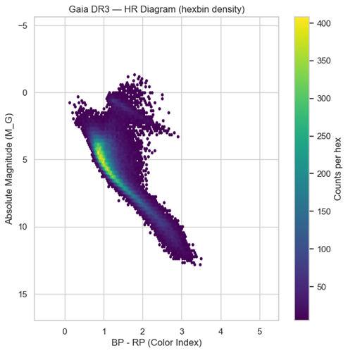
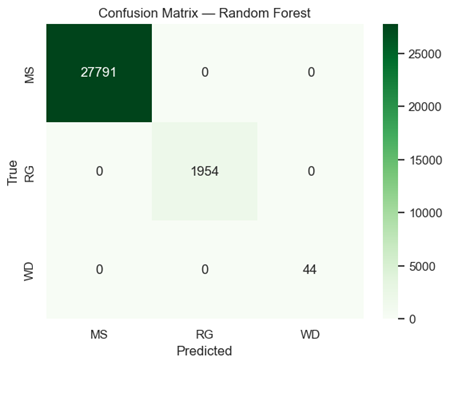

# Gaia DR3 Star Sample — HR Diagram & Stellar Classification

**Author:** Saman Mohammadi  
**Dataset:** ESA **Gaia DR3** (random sample via ADQL / astroquery)  

---

## 📌 Overview

This project builds the **Hertzsprung–Russell (HR) diagram** from a random Gaia DR3 sample using only 7 core columns, performs exploratory data analysis, and trains simple ML models to classify stars into:

- **MS** — Main Sequence  
- **RG** — Red Giants  
- **WD** — White Dwarfs  



Pipeline covered: **EDA → Feature Engineering → Modeling → Evaluation → Packaging** (portfolio-ready).

---

## 📂 Project Structure

```
Gaia DR3 Star Sample/
│
├── data/
│   ├── raw/
│   │   └── gaia_dr3_sample.csv                # raw sample from Gaia
│   └── processed/
│       └── gaia_hr_labeled.csv                # cleaned + M_G + distance + labels
│
├── notebooks/
│   └── Gaia DR3 Star Sample.ipynb             # main analysis notebook
│
├── reports/
│   └── figures/
│       ├── hr_scatter.png
│       ├── hr_hexbin.png
│       ├── confusion_logistic.png
│       ├── confusion_rf.png
│       └── feature_importance_rf.png
│
└── README.md
```

---

## 🗂 Data

- **Source:** [Gaia DR3](https://gea.esac.esa.int/archive/)  
- **Columns used (7 core):**  
  `source_id, ra, dec, parallax, phot_g_mean_mag, bp_rp, random_index`  
- Sampling: **ORDER BY random_index** (unbiased random sample)  
- Basic cleaning: drop NaNs in `phot_g_mean_mag` and `bp_rp` (<1%)

---

## ⚙️ Setup

```bash
# Python 3.10+ recommended
pip install -r requirements.txt
```

---

## ▶️ How to Run

1) Open the notebook:  
```
notebooks/Gaia DR3 Star Sample.ipynb
```

2) Run steps in order: EDA → HR Diagram → Labeling → ML models → Save outputs

3) Outputs:
- `data/processed/gaia_hr_labeled.csv`  
- Figures in `reports/figures/`

---

## 🔬 Methodology

1. **EDA**: distributions & quality checks  
2. **Feature Engineering**: distance_pc & M_G  
3. **HR Diagram**: scatter, hexbin, labeled  
4. **Rough Labeling**: MS / RG / WD  
5. **ML Models**: Logistic Regression vs Random Forest  

---

## 🏁 Results

- HR diagram shows **Main Sequence, Red Giants, White Dwarfs** clearly.  
- **Logistic Regression:** ~99% accuracy.  
- **Random Forest:** 100% accuracy.  
- Feature importance: **M_G dominates** (~0.89) vs `bp_rp` (~0.11).

---

## ⚠️ Limitations

- Labels are heuristic.  
- No extinction correction.  
- Only 7 columns used (no Teff/logg/[M/H]).

---

## 🚀 Future Work

- Add Teff/logg/[M/H] from astrophysical_parameters.  
- Extinction correction.  
- Advanced ML (XGBoost, SVM).  
- Larger samples (1M+ stars).

---

## 🙏 Acknowledgements

- **ESA Gaia** mission & **Gaia DR3** archive.
- ## 📜 License

This project is licensed under the [MIT License](LICENSE).

- `astroquery`, `pandas`, `numpy`, `matplotlib`, `seaborn`, `scikit-learn`.
